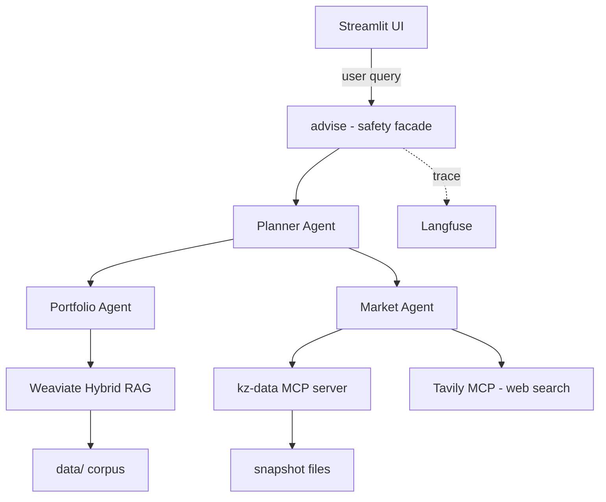
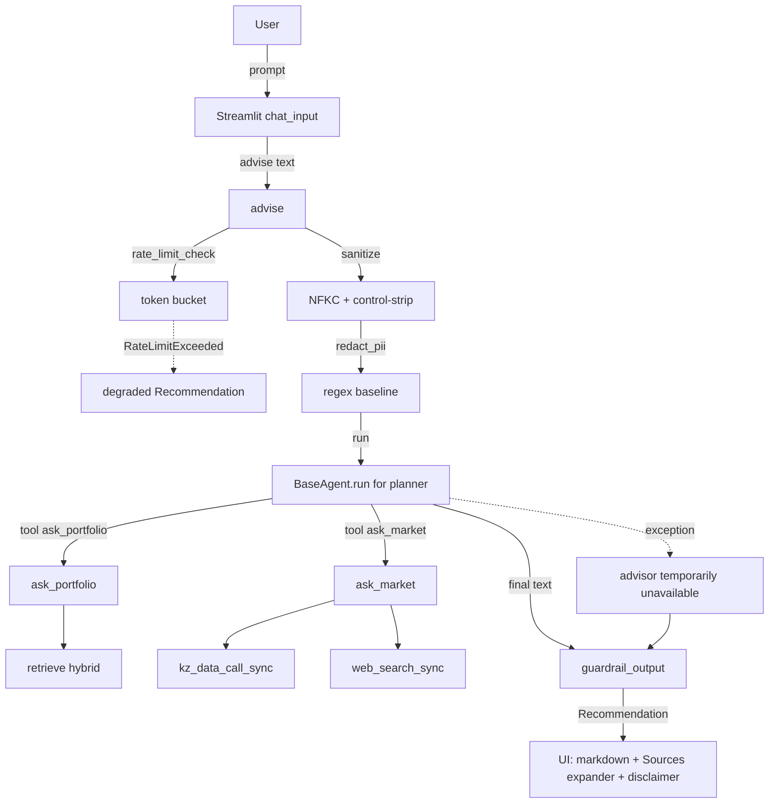
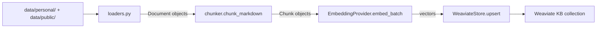

# Architecture Blueprint — Personal Investment-Planning Assistant

- **Project:** Personal Investment-Planning Assistant (PIA)
- **Author:** Nurlan
- **Status:** v0.9 (post-Phase 11; submission-ready)
- **Source of truth:** `docs/superpowers/specs/2026-05-02-personal-investment-assistant-design.md`, ADRs `docs/decisions/0001`-`0011`, implementation under `src/pia/`.

This document is the navigable, grader-facing summary of the system. It synthesizes the design spec, the implemented code, and accepted ADRs into one place. It deliberately does not repeat the full spec — the spec, ADRs, and code remain authoritative for any conflict.

---

## 1. Problem and audience

### 1.1 Real-world problem

A Kazakhstan-resident individual investor with capital but no time faces fragmented information across:

- NBK base rate and FX moves (KZT/USD, KZT/EUR, KZT/RUB).
- Bank deposit rate sheets (Halyk, Kaspi, BCC, Jusan, Freedom) that differ by currency and term.
- KASE-listed equities (HSBK, KCEL, ...) with thin English coverage.
- Almaty residential real-estate listings on Krisha.kz.
- KZ news in Russian (Tengrinews, Forbes.kz, Kazpravda, NBK announcements).

The information is in Russian, English, and occasionally Kazakh. The cost of monitoring it manually is real: idle KZT cash earns less than a current Halyk 12-month KZT deposit, KZT/USD swings shift hard-currency exposure away from a stated target, and reallocation moments are routinely missed.

### 1.2 Target user

The single sole user — a KZ-resident software developer with a six-figure-KZT-equivalent portfolio split across KZT/USD deposits, KASE equities, US ETFs, and Almaty real estate. Notes (in `data/personal/notes/`) capture the user's investment theses; `plan.md` carries the stated allocation and risk tolerance; `holdings.json` is the structured ground truth of positions.

The user is the system's only operator. There is no multi-tenant component, no auth, and no public-facing surface. This is the deliberate v1 framing per ADR 0002 (`docs/decisions/0002-domain-and-scope.md`).

### 1.3 Why this is a real product, not a toy

- The corpus is **real and multi-source**: 37 news articles, 6 bank rate sheets, KASE quote snapshots, NBK rate/FX history, Krisha.kz listings, and the user's actual investment notes.
- Every recommendation is **evidence-backed**: every `Recommendation` returned by `advise()` carries a `citations` list and a `market_sources` list, surfaced in the Streamlit UI as an expandable Sources block.
- The system is **honest about its limits**: a non-removable disclaimer is a Pydantic field on every `Recommendation` (not a model-discretion string), the Planner refuses definitive buy/sell calls and hedges them via the output guardrail, and tool failures degrade gracefully rather than hallucinating.
- It runs **locally**: one `docker compose up -d weaviate` plus `uv run streamlit run` is the entire deployment — see ADR 0003 (`docs/decisions/0003-tech-stack-overview.md`) and ADR 0007 (`docs/decisions/0007-vector-store-weaviate.md`).

---

## 2. System diagram



**Key invariants visible in the diagram:**

- The Planner is the only agent talking to the user. Portfolio and Market do not call each other (ADR 0004).
- All inter-agent traffic is **in-process** typed Pydantic envelopes (`AgentMessage` in `src/pia/messages.py`) — no network, no shared queue, no shared filesystem.
- The Market Agent is the only consumer of MCP. RAG is the only consumer of Weaviate.
- Observability is a side-channel: every decorated function emits a Langfuse span when keys are set; otherwise the decorators are no-ops.

---

## 3. Component inventory

| Layer | File / module | Responsibility |
|---|---|---|
| **Agents** | `src/pia/agents/base.py` | `BaseAgent` — generic tool-calling loop with budget cap, JSON-arg validation, and degraded-tool handling. Returns `AgentRunResult` with `tool_calls_made`, `tool_errors`, `budget_exhausted`. |
| | `src/pia/agents/planner.py` | Planner / Advisor agent. Wraps the safety facade around the inner LLM call; collects citations and market sources via closure-based ledgers; always returns a `Recommendation` even when the inner planner raises. |
| | `src/pia/agents/portfolio.py` | Portfolio agent. Tools: `retrieve` (Weaviate hybrid) and `get_holdings` (reads `data/personal/holdings.json`). Returns `PortfolioAnswer` with citations. |
| | `src/pia/agents/market.py` | Market agent. Tools: `get_nbk_rate`, `get_fx_rate`, `get_kase_quote`, `get_deposit_rates` (custom kz-data MCP) and `web_search` (Tavily MCP). Returns `MarketAnswer` with `degraded` flag when an upstream tool fails. |
| **Messages** | `src/pia/messages.py` | Pydantic envelopes: `AgentMessage` (with `request_id`, `sender`, `receiver`, `payload`), `PortfolioQuery/Answer`, `MarketQuery/Answer`, `Recommendation`, `Citation`, `MarketSource`, `Action`. The disclaimer is a default field on `Recommendation`. |
| **RAG** | `src/pia/rag/loaders.py` | Loaders for `user_note`, `user_plan`, `user_holdings`, `news`, `bank_rates`, `kase`, `nbk`, `real_estate` source slugs. Markdown front-matter + JSON flattening. |
| | `src/pia/rag/chunker.py` | Heading-aware paragraph chunker (`max_tokens=600`, `overlap_tokens=80`). Tracks heading breadcrumb on each `Chunk`. |
| | `src/pia/rag/store.py` | `WeaviateStore`: single `KB` collection, hybrid search (`alpha=0.5`, `RELATIVE_SCORE` fusion), `published_at` stored as TEXT (ADR 0009), `embedding_model` recorded per chunk. |
| | `src/pia/rag/retrieve.py` | `retrieve(query, k, source, alpha)` — opens a `WeaviateStore`, runs hybrid search, closes the client. Decorated with `@trace("rag.retrieve")`. |
| **Embeddings** | `src/pia/embeddings/base.py` | `EmbeddingProvider` Protocol (`embed_one`, `embed_batch`, `name`). |
| | `src/pia/embeddings/local.py` | `BAAI/bge-m3` via `sentence-transformers` (default; multilingual; `$0` path). |
| | `src/pia/embeddings/litellm.py` | LiteLLM-backed provider for hosted embeddings (OpenAI / Gemini). |
| **MCP** | `src/pia/mcp/server.py` | Custom `kz-data` FastMCP server, 4 tools backed by snapshot files under `data/public/`. |
| | `src/pia/mcp/client.py` | stdio MCP client. `kz_data_call_sync` and `web_search_sync` wrappers, both `@trace`-decorated. Tavily falls back to `[]` when `TAVILY_API_KEY` is missing. |
| | `src/pia/mcp/tools/` | Per-tool data adapters: `nbk.py`, `fx.py`, `kase.py`, `deposits.py`. Surface `as_of` / `last_updated` on every response. |
| **Safety** | `src/pia/safety/sanitize.py` | Strip ASCII control chars, NFKC, trim, cap to 8 000 chars. |
| | `src/pia/safety/pii.py` | Regex-baseline redaction for KZ IIN, phone, IBAN, email. No spaCy/Presidio dep (ADR 0011). |
| | `src/pia/safety/ratelimit.py` | Token-bucket, default 10 req/min/process. `RateLimitExceeded` is caught in `advise()` and surfaced as a degraded `Recommendation`. |
| | `src/pia/safety/guardrail.py` | Output check: redact known credential tokens, hedge definitive buy/sell calls. Idempotent. |
| | `src/pia/safety/disclaimer.py` | Default disclaimer string consumed by `Recommendation`. |
| **Observability** | `src/pia/observability/langfuse.py` | Thin Langfuse adapter. `trace(name)` decorator is a no-op when `LANGFUSE_PUBLIC_KEY` is unset (so CI / graders without keys still run cleanly). Uses `Langfuse.start_as_current_observation` (the stable 4.x API; `start_as_current_span` does not exist in 4.x — see ADR 0010). |
| **LLM** | `src/pia/llm/client.py` | `LLMClient` over LiteLLM. Normalizes provider differences in tool-call shapes. `tool_choice="auto"` when tools provided. Decorated with `@trace("llm.chat")`. |
| **Eval** | `src/pia/eval/retrieval.py` | `evaluate_retrieval(cases, k)`, `hit_rate_at_k(results)`. Drives `tests/integration/test_retrieval_metric.py` against the labeled set in `tests/fixtures/retrieval_labels.yaml`. |
| | `src/pia/eval/faithfulness.py` | LLM-as-judge: scores 0/1/2 against retrieved context for the golden Q&A set. Robust to fenced JSON output. |
| **UI** | `src/pia/ui/app.py` | Streamlit entry. Disclaimer banner → portfolio sidebar (live FX from MCP with constants fallback) → freshness pill → chat. Renders citations as expander, surfaces degraded responses as `st.error` with a Try-again button. |
| | `src/pia/ui/components.py` | Reusable components: `disclaimer_banner`, `allocation_pie` / `currency_pie` (Altair donut), `portfolio_sidebar`, `citation_block`, `render_history_citations`, `freshness_pill`, `collect_snapshot_dates`. |
| **CLI** | `src/pia/cli.py` | Typer CLI: `ask "question"` (calls `advise`) and `info` (active config). |
| **Config** | `src/pia/config.py` | Pydantic-settings: `LLM_MODEL`, `EMBEDDING_PROVIDER`, Weaviate host/ports, Tavily key, rate limit, etc. Single `get_settings()` accessor. |
| **Scripts** | `scripts/ingest.py` | One-shot ingest: load → chunk → embed → upsert into Weaviate `KB` collection. `--reset` recreates the collection. |
| | `scripts/snapshot_news.py` | Helper for refreshing the public news corpus snapshot. |
| **Tests** | `tests/unit/` (14 files) | `BaseAgent` loop edge cases, planner citations, planner disclaimer / always-returns-Recommendation, chunker, loaders, embeddings, LLM client, MCP tools, PII / sanitize / rate-limit / guardrail, smoke. |
| | `tests/integration/` (5 files) | `test_positive_qa` (golden Q&A; live-LLM-gated), `test_retrieval_metric` (hit-rate@5 against the labeled set), `test_faithfulness` (LLM-as-judge on the golden set), `test_mcp` (real subprocess round-trip), `test_store` (Weaviate hybrid search). |
| | `tests/adversarial/` (7 files) | Prompt injection (planted note), jailbreak (definitive-call refusal), irrelevant query, source conflict, MCP timeout, PII probe, hallucination probe. Marker: `@pytest.mark.adversarial`. |
| | `tests/fixtures/` | `golden_qa.yaml` (5 cases EN+RU), `retrieval_labels.yaml` (5 queries), `adversarial_inputs.yaml` (7 scenarios). |
| **Docs** | `docs/brief.md`, `docs/non_functional_requirements.md`, `docs/success_criteria.md`, `docs/requirements_addendum.md` | Original requirements + Q&A meeting addenda. |
| | `docs/superpowers/specs/2026-05-02-personal-investment-assistant-design.md` | Full design spec. |
| | `docs/superpowers/plans/` | Pre-draft and post-draft phased implementation plans. |
| | `docs/decisions/0001`-`0011` | ADRs (see §5 below). |
| | `docs/draft-issues.md` | Punch list of pre-draft deferrals; Phases 7-11 close most of them. |

---

## 4. Data flow

### 4.1 Query → answer



Notes:

- The **safety facade order** (ADR 0011) is `rate_limit → sanitize → redact → run → guardrail`. Each layer is a pure function in its own module.
- `advise()` always returns a `Recommendation`. If the inner planner raises, the summary becomes `"The advisor is temporarily unavailable (<ExceptionType>)."` — proven by `tests/unit/test_planner_disclaimer.py`.
- Citations are collected via a **closure-based ledger** (`citation_ledger: list[Citation]`) that the per-call `_portfolio_handler` extends. The same pattern collects `MarketSource` from the Market agent.
- Every decorated function emits a Langfuse span when keys are set: `agent.planner.advise → agent.run → llm.chat → agent.portfolio → agent.run → llm.chat → rag.retrieve → ...`.

### 4.2 Ingest → vector store



- One `KB` collection holds chunks from all sources (`source` is a property, not a separate collection — simpler than the spec's per-source-collection design and sufficient at this corpus size).
- Each chunk's `embedding_model` is recorded so a provider swap requires re-ingest, not silent dimension skew (ADR 0008).
- `published_at` is stored as TEXT (ISO date string), not DATE — see ADR 0009 for the reasoning and the migration path.

### 4.3 MCP tool call

```mermaid
flowchart LR
    AG[Market Agent] -->|kz_data_call_sync get_nbk_rate| ASYNCIO[asyncio.run]
    ASYNCIO --> CTX[stdio_client + ClientSession]
    CTX -->|spawn subprocess| SVR[python -m pia.mcp.server]
    SVR -->|FastMCP tool dispatch| TOOL[tools/nbk.py]
    TOOL -->|read snapshot| SNAP[data/public/nbk/fx_history.json]
    SNAP -->|JSON dict| TOOL
    TOOL -->|return| SVR
    SVR -->|MCP response| CTX
    CTX -->|.content[0].text| ASYNCIO
    ASYNCIO -->|JSON string| AG
```

- Each call spawns a fresh subprocess (no pooling in v1 — listed under §8 future work).
- `web_search_sync` follows the same pattern but spawns `npx -y @tavily/mcp` and falls back to `[]` when `TAVILY_API_KEY` is unset.
- Both calls are wrapped with `@trace("mcp.kz_data")` / `@trace("mcp.web_search")` for Langfuse correlation.
- Tool failures (`TimeoutError`, subprocess crash, parse error) raise into the agent's tool-call handler, which appends a `ToolError` to the messages and continues — see `BaseAgent.run` in `src/pia/agents/base.py`. Adversarial test `tests/adversarial/test_mcp_timeout.py` exercises this path.

---

## 5. ADR index

ADRs live under `docs/decisions/` and are written at the time of decision (ADR 0001 itself documents this convention).

| ADR | Decision | Why it matters |
|---|---|---|
| [0001](decisions/0001-use-architecture-decision-records.md) | Use Architecture Decision Records | Every meaningful design choice has a paper trail for graders and future-self; AI-assisted iterations stay aligned. |
| [0002](decisions/0002-domain-and-scope.md) | Domain — KZ-resident personal investment assistant; v1 asset classes and explicit non-goals | Fixes the problem framing, justifies real-corpus data, sets up adversarial tests around buy/sell hedging. |
| [0003](decisions/0003-tech-stack-overview.md) | Tech stack — Python 3.12, uv, LiteLLM, Weaviate, FastMCP, Streamlit, Pydantic, Langfuse, pytest | Single language, vibe-coding-friendly, $0 grader path via free-tier components. |
| [0004](decisions/0004-agent-topology.md) | 3 agents, orchestrator-worker, in-process Pydantic message bus | Distinct roles satisfy the brief; in-process bus keeps trace correlation simple; rejects swarm and HTTP-microservice alternatives with reasons. |
| [0005](decisions/0005-mcp-strategy.md) | Consume Tavily web-search MCP **and** build a custom `kz-data` MCP with 4 tools | Demonstrates protocol mastery (build, not just consume); KZ-specific data has no off-the-shelf MCP; snapshot-backed for deterministic demo. |
| [0006](decisions/0006-llm-provider-abstraction.md) | LiteLLM as the single LLM client; `LLM_MODEL` env switches provider | $0 grader path (Gemini Flash) coexists with paid demo path (Sonnet 4.6); tool-call shape unified across providers. |
| [0007](decisions/0007-vector-store-weaviate.md) | Self-hosted Weaviate via Docker Compose; one collection; hybrid search `alpha=0.5` | First-class hybrid (BM25 + dense) materially helps multilingual + entity-heavy KZ content. |
| [0008](decisions/0008-embeddings-strategy.md) | `EmbeddingProvider` interface; default local `BAAI/bge-m3` | Multilingual (RU+EN+KZ) without paid quota; provider switch triggers re-index, not silent skew. |
| [0009](decisions/0009-published-at-storage.md) | `published_at` stored as `DataType.TEXT`, not `DATE` | Avoids schema migration; ISO date strings sort lexicographically; date-range filters happen as post-retrieval Python (acceptable at v1 corpus size). |
| [0010](decisions/0010-observability-langfuse.md) | Langfuse cloud free tier; `start_as_current_observation`; no-op when keys unset | Zero-friction local dev (no errors without keys); `request_id = AgentMessage.request_id` joins spans into one trace. |
| [0011](decisions/0011-safety-layered-facade.md) | Layered facade: `rate_limit → sanitize → redact → planner.run → guardrail` | Each concern a pure function in its own module; PII never reaches LLM trace in plaintext; guardrail subsumes the inline definitive-call hedge. |

**ADR 0012 placeholder.** The plan reserved an ADR-0012 slot for "evaluation harness." That ADR was not written in v1 — instead, evaluation is captured by concrete code (`src/pia/eval/retrieval.py`, `src/pia/eval/faithfulness.py`) and the test fixtures (`tests/fixtures/golden_qa.yaml`, `tests/fixtures/retrieval_labels.yaml`, `tests/fixtures/adversarial_inputs.yaml`). A future ADR-0012 would formalize: thresholds (hit-rate@5 ≥ 0.6; faithfulness ≥ 1), the live-LLM gating convention (`PIA_LIVE_LLM=1`), and the persisted-eval-runs convention under `docs/eval-runs/`. Treating evaluation as code-plus-fixtures rather than a separate ADR is a deliberate choice for v1 — the artifacts are honest about what is and is not measured.

---

## 6. Tech stack rationale

| Choice | Why |
|---|---|
| **Python 3.12** | Mature AI ecosystem (LiteLLM, Weaviate v4 client, FastMCP, sentence-transformers). Owner is fluent. Single-language reduces context-switching during a 16-day vibecoded build. |
| **`uv` + `pyproject.toml`** | Fast resolver, reproducible installs (`uv.lock`), `uv run …` keeps the dev surface small. Capstone reviewers can run `uv sync --all-extras` once and be done. |
| **LiteLLM** | One client class wraps Anthropic / Gemini / Groq / OpenAI / Ollama tool-calling under the OpenAI schema. `$0` grader run on Gemini Flash; demo on Sonnet 4.6 for tool-use reliability. ADR 0006. |
| **Weaviate** (self-hosted Docker, single node) | Out-of-the-box hybrid (BM25 + dense) without a second store. Multilingual-friendly with `bge-m3`. Persistent volume; one container. ADR 0007. |
| **Local embeddings (`BAAI/bge-m3`)** | Multilingual model designed for RU+EN+KZ retrieval. Lazy-loaded (~600MB on first ingest, cached afterwards). The `$0` grader path is real because the embedding model lives on disk. ADR 0008. |
| **FastMCP (server) + official `mcp` SDK (client)** | FastMCP gives a 50-line, decorator-based MCP server in pure Python; the SDK is the reference stdio transport. Custom `kz-data` server cleanly isolates KZ-specific data fetching from agent code. ADR 0005. |
| **Streamlit** | Fastest path to "investor-ready" demo. The +10 UX bonus does not require a custom React SPA. Altair donut charts + sidebar + chat ship in a few hundred LOC. ADR 0003. |
| **Pydantic v2** | Typed message bus (`AgentMessage`, `Citation`, `Recommendation`) catches contract drift at runtime; `Recommendation.disclaimer` is a default field, guaranteeing the disclaimer is structural, not model-discretion. |
| **Langfuse** (free tier; cloud) | Single decorator (`@trace`) per agent / LLM / tool / RAG call; `start_as_current_observation` propagates parent-child relationships via SDK context. Zero overhead when keys unset. ADR 0010. |
| **pytest** (+ pytest-asyncio, pytest-mock) | Standard. Custom markers (`smoke`, `integration`, `adversarial`, `live_llm`) gate the long-running suites so unit tests are still fast. |

**Capstone-constraint mapping:**

- **Local app, not a notebook** — the deployment is one Docker container (Weaviate) plus one `uv`-managed Python process (Streamlit). No notebooks are part of the product surface.
- **Own code for core agentic logic** — `BaseAgent.run`, `advise()`, `ask_portfolio`, `ask_market`, all messages, the safety facade, and the custom MCP server are written here. LiteLLM and `mcp` SDK are libraries, not orchestration platforms (which is what the Q&A meetings prohibited).
- **Free-tier path** — local embeddings + free Gemini Flash + self-hosted Weaviate + Langfuse free tier = `$0` reproducible grader run.
- **Demonstrability** — Streamlit UI + scripted demo (Phase 14 in the plan) + adversarial tests visible in `tests/adversarial/`.

---

## 7. Non-functional posture

### 7.1 Observability

- **Tracing:** Langfuse adapter at `src/pia/observability/langfuse.py`. `trace(name)` decorates `LLMClient.chat`, `BaseAgent.run`, `ask_portfolio`, `ask_market`, `advise`, `retrieve`, `kz_data_call_sync`, `web_search_sync`. `start_as_current_observation` propagates parent-child relationships through the SDK's context — no manual correlation needed.
- **No-op when unconfigured:** the decorator returns the original function unchanged when `LANGFUSE_PUBLIC_KEY`/`LANGFUSE_SECRET_KEY` are unset. Unit tests, CI, and grader runs all work without Langfuse credentials.
- **Trace identifier:** `AgentMessage.request_id` (UUID4 default) is the conceptual trace key; in practice the SDK's automatic context handles parent-child grouping per `advise()` call.

**Current limitations:**

- `request_id` is not threaded through to Langfuse as an explicit trace ID — relies on SDK context.
- No metrics surface (request count, p50/p95 latency, tool-error rate). These were planned but deferred — see §8 future work.
- No structured JSON log adapter; standard logging is used. Errors at the `advise()` boundary are caught and surfaced to the UI as a friendly degraded message.
- No in-app diagnostics tab or Grafana dashboard. The Langfuse dashboard is the operator-facing surface when keys are set.

### 7.2 Safety

The safety facade (ADR 0011) is a layered series of pure functions wrapping `planner.run` inside `advise()`:

1. **`rate_limit_check()`** — token bucket, default 10 req/min/process. `RateLimitExceeded` is caught in `advise()` and returned as a degraded `Recommendation` (the disclaimer still ships).
2. **`sanitize_input()`** — strip ASCII control chars (preserve `\n`, `\t`), NFKC-normalize, trim, cap at 8 000 chars.
3. **`redact_pii()`** — regex baseline for KZ IIN (12 digits at word boundary), KZ phone (`+7`/`8`-prefix), KZ IBAN (`KZdd[A-Z0-9]{16}`), email. Phone is matched before IIN to avoid mis-classifying `+7XXXXXXXXXX` as a 12-digit IIN.
4. **`planner.run()`** — the LLM call, intentionally isolated so the degraded-path try/except is uniform.
5. **`guardrail_output()`** — redact known-leak credential tokens (currently `{"hunter2"}` from the adversarial fixtures); hedge definitive buy/sell calls by prepending `"Hedged note: "`. Idempotent.

**The disclaimer is a Pydantic field**, not a model-generated string — guaranteed present even on tool failure. See `Recommendation.disclaimer` default in `src/pia/messages.py`.

**Known limitations** (ADR 0011, §Negative):

- Rate limiter is process-local: Streamlit hot-reloads reset the bucket. Acceptable for a single-user local demo; a production deployment would use Redis-backed counters.
- Regex PII has false positives (a bare 12-digit number that is not a real IIN is redacted). Conservative for a financial context; documented.
- The known-leak token set is hand-curated.

### 7.3 RAG QA

- **Retrieval labels** at `tests/fixtures/retrieval_labels.yaml` (5 queries, EN+RU, mapping to expected source slugs).
- **Hit-rate@5** computed by `src/pia/eval/retrieval.py`; `tests/integration/test_retrieval_metric.py` asserts ≥ 0.6 against the labeled set.
- **Golden Q&A** at `tests/fixtures/golden_qa.yaml` (5 cases EN+RU); `tests/integration/test_positive_qa.py` runs them through `advise()` end-to-end (gated by `PIA_LIVE_LLM=1`).
- **Faithfulness LLM-judge** at `src/pia/eval/faithfulness.py`; `tests/integration/test_faithfulness.py` asserts score ≥ 1 on every golden case (also live-LLM-gated).
- **Source attribution** is structural: every `Recommendation` carries `citations` and `market_sources`; the UI renders them in the Sources expander.

### 7.4 Cost / resource

- **Local-first by default.** Weaviate self-hosted (one Docker container with a persistent volume). Streamlit and the agent code run as a local `uv` Python process.
- **Free-tier hosted LLM path.** `LLM_MODEL=gemini/gemini-2.0-flash` plus `EMBEDDING_PROVIDER=local` runs the entire stack at `$0`.
- **Local embeddings.** `BAAI/bge-m3` is downloaded once (~600MB) and reused.
- **No cloud deployment required.** The capstone runs from a fresh clone in <10 minutes (Docker pull + `uv sync` + first ingest dominate).
- **Resource metrics not currently exposed.** Memory/CPU/API-quota counters are noted as a gap in the post-draft plan and left to future work.

### 7.5 Compliance / ethics

- **Disclaimer** is a structural Pydantic field on every `Recommendation` (`"This is informational only and not licensed financial, legal, or tax advice. Consult a licensed professional before acting."`).
- **No brokerage execution path.** The system advises only — there is no order placement, no API integration with a broker. ADR 0002 explicitly excludes execution.
- **Single-user local runtime.** No public surface, no auth, no PII storage beyond what the user voluntarily places in their own notes (which are git-ignored under `data/personal/`).
- **Definitive-call hedge** in `guardrail_output` covers EN and RU verbs (`buy`, `sell`, `recommend buying`, `купить`, `продать`, `обязательно купите`, ...). Adversarial test `tests/adversarial/test_jailbreak.py` exercises the refusal.
- **Transparency.** Every tool response surfaces `as_of` / `last_updated`. The UI's freshness pill summarizes the oldest snapshot date so the user can judge staleness at a glance.

---

## 8. Future work

Drawn from `docs/draft-issues.md` (post-draft binding requirements that did not land in v1) and from current code gaps. The list is intentionally honest — items that are already done in v1 are not duplicated here.

**Data freshness**
- Live snapshot refresh job for NBK / KASE / news / bank rates. Today these are committed snapshots refreshed manually via `scripts/snapshot_news.py`.
- Cross-encoder reranker (`BAAI/bge-reranker-base`) on top of hybrid retrieval, gated behind `RERANK=true`. The hybrid search already meets the hit-rate@5 ≥ 0.6 threshold without it.

**Asset coverage**
- Crypto, gold, UAPF, AIX bonds, mutual funds. Explicitly out-of-scope per ADR 0002, but they are obvious next-step expansions that the demo voiceover should mention.

**Observability depth**
- Metrics dashboard (request count, p50/p95 latency, tool-error rate, refusal rate). Today only Langfuse spans are emitted; counters and histograms are not exposed.
- In-app diagnostics tab (last trace ID, last latency, tool-call counts) — designed in the spec, not implemented in v1.
- Resource-usage tracking (memory, CPU, hosted-LLM quota) — listed in `non_functional_requirements.md` but only partially covered (Langfuse shows token usage when keys are set).

**MCP performance**
- Subprocess pooling for repeated MCP calls. Each `kz_data_call_sync` currently spawns a fresh subprocess; in a single Planner run with 3-5 tool calls, subprocess startup is the dominant latency.

**Eval reports**
- Persisted JSON eval reports under `docs/eval-runs/` (one per run, with model name, fixture set, scores). The directory exists; the reporting harness is not wired up.

**Multi-user / auth**
- Authentication, multi-tenancy, server-side state. Out-of-scope by design; would require a deployment shape change (server, session storage, isolation per user).

**UI polish**
- Live news refresh and richer provenance on web-search results.
- Optional `streamlit-extras` chip components for citations.
- Localized UI labels (currently English-only; source content is RU/EN/KZ).

**Storage migration**
- Convert `published_at` to `DataType.DATE` once a concrete date-range filter UI lands (ADR 0009).

**Demo / submission**
- Recorded 2-5 minute video with voiceover (Phase 14 in the plan).
- Executive Summary 1-2 pages (Phase 13).
- `Capstone_project_<First>_<Last>.txt` submission file (Phase 15).

---

> Informational only. **Not** licensed financial, legal, or tax advice. The system advises; the user decides; a licensed professional confirms.
