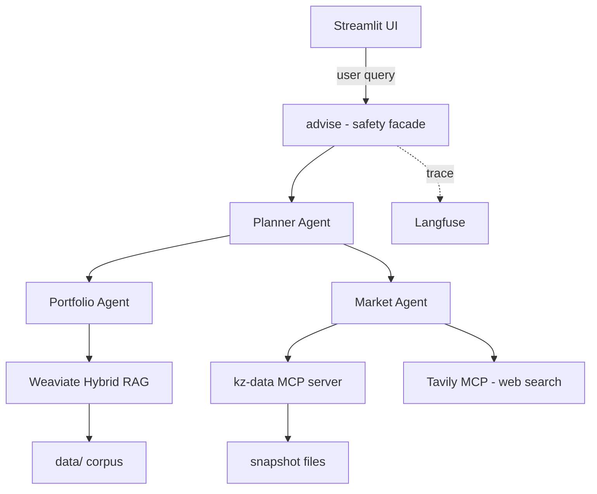

# Claude Code Next Session Prompt - Phase 12

You are working in this repository:

`/Users/nashirba/epam_course/task_1`

The project is a Personal Investment-Planning Assistant capstone. It has stopped at **Phase 12** from:

`docs/superpowers/plans/2026-05-02-pia-post-draft.md`

Use the project's existing **Superpowers plan** as the source of truth. Your task is to complete **Phase 12 only**:

1. Create `docs/architecture_blueprint.md`
2. Create `docs/self_review.md`

Do not start Phase 13, Phase 14, or Phase 15. Do not implement new product features unless a tiny doc-supporting fix is unavoidable.

## Required Reading

Before writing, read these files:

- `docs/superpowers/plans/2026-05-02-pia-post-draft.md`, especially Phase 12
- `docs/superpowers/specs/2026-05-02-personal-investment-assistant-design.md`
- `docs/brief.md`
- `docs/requirements_addendum.md`
- `docs/non_functional_requirements.md`
- `docs/success_criteria.md`
- all ADRs under `docs/decisions/`
- `README.md`
- representative implementation files:
  - `src/pia/agents/base.py`
  - `src/pia/agents/planner.py`
  - `src/pia/agents/portfolio.py`
  - `src/pia/agents/market.py`
  - `src/pia/messages.py`
  - `src/pia/rag/loaders.py`
  - `src/pia/rag/chunker.py`
  - `src/pia/rag/store.py`
  - `src/pia/rag/retrieve.py`
  - `src/pia/mcp/server.py`
  - `src/pia/mcp/client.py`
  - `src/pia/safety/*.py`
  - `src/pia/observability/langfuse.py`
  - `src/pia/ui/app.py`

Also inspect `tests/` enough to describe the testing posture accurately.

## Phase 12 Deliverable 1: Architecture Blueprint

Create `docs/architecture_blueprint.md`.

This document is for graders and should be self-contained. It must synthesize the actual implementation, the design spec, and ADRs. Do not just paste the spec.

Include these sections:

1. **Problem And Audience**
   - Explain the Kazakhstan-resident investor use case.
   - State the target user and why the project is real-world, not toy.

2. **System Diagram**
   - Include a Mermaid diagram based on the Phase 12 plan:



3. **Component Inventory**
   - Make a table of the main files/modules and their responsibility.
   - Include agents, messages, RAG, embeddings, MCP, safety, observability, UI, CLI, scripts, tests, and docs/ADRs.

4. **Data Flow**
   - Add one Mermaid or clear textual figure for each major path:
     - query to answer
     - ingest to vector store
     - MCP tool call
   - Mention typed `AgentMessage` envelopes and `Recommendation` output.

5. **ADR Index**
   - Table referencing ADRs `0001` through the highest existing ADR.
   - Columns: ADR, Decision, Why It Matters.
   - If ADR 0012 does not exist, do not invent it. Say evaluation is covered by the test fixtures/harness and future ADR candidate if needed.

6. **Tech Stack Rationale**
   - Explain Python 3.12, uv, LiteLLM, Weaviate, local embeddings, FastMCP, Streamlit, Pydantic, Langfuse, pytest.
   - Tie choices to capstone constraints: local app, own agentic/MCP code, free-tier path, demonstrability.

7. **Non-Functional Posture**
   - Observability: Langfuse adapter and current limitations.
   - Safety: sanitize, PII redaction, rate limit, guardrail, disclaimer.
   - RAG QA: retrieval labels, golden QA, faithfulness judge.
   - Cost/resource: local-first, self-hosted Weaviate, local embeddings, free hosted LLM option.
   - Compliance/ethics: disclaimer, no brokerage execution, single-user local runtime.

8. **Future Work**
   - Draw from `docs/draft-issues.md` and actual current gaps.
   - Include only honest items, such as live refresh, more asset classes, stronger observability metrics/dashboard, MCP pooling, reranker, expanded eval reports, authentication if multi-user.

Writing style:

- Professional, concise, grader-friendly.
- Use concrete file paths.
- Avoid overclaiming features that are not implemented.
- Make it clear this is an MVP+ local product.

## Phase 12 Deliverable 2: Self-Review

Create `docs/self_review.md`.

Include these sections:

1. **What We Built**
   - Exactly 3 short sentences.

2. **What Worked Well**
   - 5 bullets.
   - Cover: 3-agent topology, typed Pydantic bus, custom MCP, local-first RAG, safety facade, ADR discipline, tests.

3. **What We Cut And Why**
   - Cite `requirements_addendum.md` non-goals and deferred work from `docs/draft-issues.md`.
   - Be honest: no live refresh, no brokerage execution, no multi-user auth, no cross-encoder reranker unless implemented, limited resource metrics, snapshot data.

4. **What We Would Change With Another Week**
   - Concrete next steps, not vague aspirations.
   - Examples: live snapshot refresh job, saved eval reports, richer Langfuse/diagnostics dashboard, MCP subprocess pooling, real news refresh/provenance improvement, video polish.

5. **Lessons**
   - Cover vibecoding/AI-assisted development, ADR-driven planning, free-tier engineering, safety in financial assistant context, testing LLM behavior.

Writing style:

- Candid and technical.
- Do not sound like marketing.
- Show ownership and understanding of tradeoffs.

## Guardrails

- Do not modify unrelated code.
- Do not overwrite user changes. Check `git status --short` first.
- The current repo may have an unrelated modified `docs/success_criteria.md`; do not revert it unless explicitly asked.
- Use ASCII by default. Mermaid labels may use plain hyphens instead of em dashes.
- Keep docs accurate to the current implementation.
- If you discover that a planned Phase 12 claim is not true in code, document the limitation instead of pretending it exists.

## Verification

After creating the docs:

1. Run:

```bash
git status --short
```

2. Optionally run:

```bash
uv run pytest tests/unit
```

If `uv` cannot access its cache due to sandbox permissions, report that and do not force unrelated changes.

## Expected Final Response

Summarize:

- created files
- key content included
- any limitations or follow-up items left for Phase 13+
- verification command results

Do not commit unless explicitly asked.
